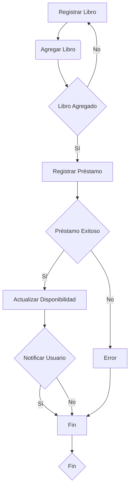
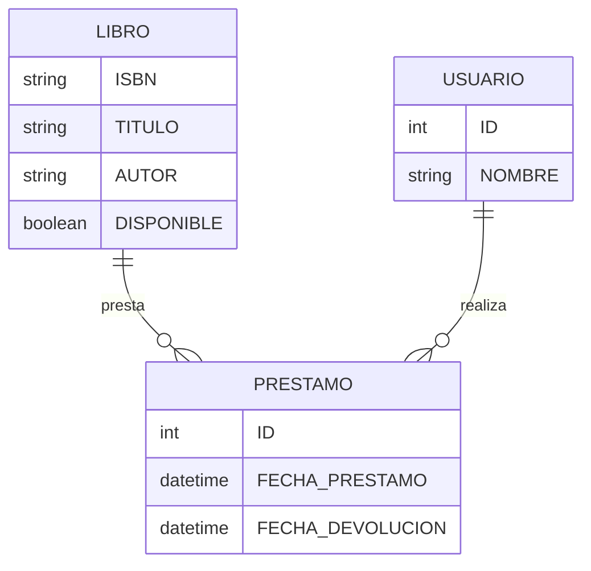
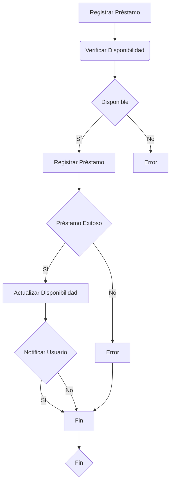
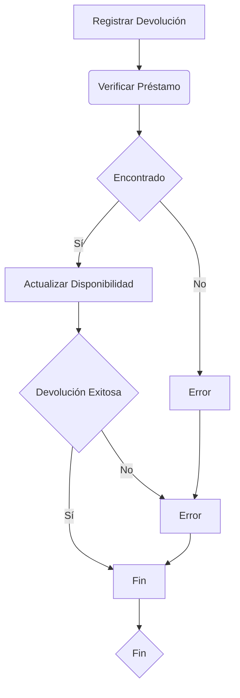
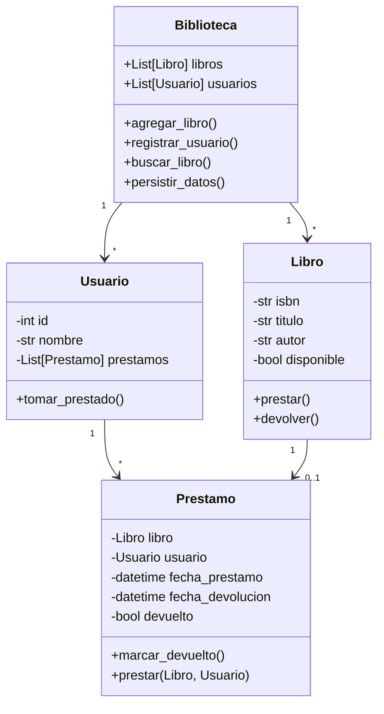

# Capitulo: Análisis Orientado a Objetos vs. Análisis Estructurado en Python

## 1. Introducción

Esta unidad explora las diferencias entre el Análisis Orientado a Objetos (AOO) y el Análisis Estructurado (AE), centrándonos en implementaciones prácticas con Python.

### Objetivos de Aprendizaje
- Comprender las diferencias clave entre AOO y AE
- Implementar soluciones usando ambos enfoques en Python
- Evaluar qué enfoque usar según el proyecto
- Aplicar buenas prácticas de programación en ambos paradigmas

## 2. Sistema de Biblioteca: Caso Práctico

### Requerimientos Principales
- Gestión de usuarios (estudiantes y bibliotecarios)
- Control de préstamos y devoluciones
- Búsqueda y consulta de libros
- Notificaciones de vencimiento

### Modelado del Sistema

#### Enfoque Estructurado (AE)
```python
# Estructura de datos
libros = {}
usuarios = {}
prestamos = {}

def agregar_libro(isbn, titulo, autor):
    """Agrega un nuevo libro al sistema."""
    if isbn not in libros:
        libros[isbn] = {
            'titulo': titulo,
            'autor': autor,
            'disponible': True
        }
        return True
    return False

def prestar_libro(isbn, id_usuario):
    """Registra el préstamo de un libro."""
    if isbn in libros and libros[isbn]['disponible']:
        if id_usuario in usuarios:
            libros[isbn]['disponible'] = False
            prestamos[len(prestamos) + 1] = {
                'isbn': isbn,
                'id_usuario': id_usuario,
                'fecha_prestamo': datetime.now(),
                'fecha_devolucion': datetime.now() + timedelta(days=14)
            }
            return True
    return False
```

##### Diagrama de flujo de datos de la Biblioteca


##### Diagrama entidad relación de la Biblioteca

##### Hacer una tabla con el diccionario de datos de la biblioteca

Tabla: Libro
Campos
- ISBN: string - Clave primaria
- TITULO: string - Título del libro
- AUTOR: string - Autor del libro
- DISPONIBLE: boolean - Indica si el libro está disponible para préstamo

Tabla: Usuario
Campos
- ID: int - Clave primaria
- NOMBRE: string - Nombre del usuario

Tabla: Prestamo
Campos
- ID: int - Clave primaria
- FECHA_PRESTAMO: datetime - Fecha de préstamo
- FECHA_DEVOLUCION: datetime - Fecha de devolución

##### Diagrama de flujo de datos cuando se presta un libro

##### Diagrama de flujo de datos cuando se devuelve un libro

#### Enfoque Orientado a Objetos (AOO)
```python
from datetime import datetime, timedelta
from typing import List, Optional

class Libro:
    def __init__(self, isbn: str, titulo: str, autor: str):
        self.isbn = isbn
        self.titulo = titulo
        self.autor = autor
        self.disponible = True
        self.prestamo_actual = None

    def prestar(self, usuario: 'Usuario') -> bool:
        if self.disponible:
            self.disponible = False
            self.prestamo_actual = Prestamo(self, usuario)
            return True
        return False

    def devolver(self) -> bool:
        if not self.disponible:
            self.disponible = True
            self.prestamo_actual = None
            return True
        return False

class Usuario:
    def __init__(self, id: int, nombre: str):
        self.id = id
        self.nombre = nombre
        self.prestamos: List[Prestamo] = []

    def tomar_prestado(self, libro: Libro) -> bool:
        if libro.prestar(self):
            self.prestamos.append(libro.prestamo_actual)
            return True
        return False

class Prestamo:
    def __init__(self, libro: Libro, usuario: Usuario):
        self.libro = libro
        self.usuario = usuario
        self.fecha_prestamo = datetime.now()
        self.fecha_devolucion = self.fecha_prestamo + timedelta(days=14)
        self.devuelto = False

class Biblioteca:
    def __init__(self):
        self.libros: List[Libro] = []
        self.usuarios: List[Usuario] = []
        self.prestamos: List[Prestamo] = []

    def agregar_libro(self, isbn: str, titulo: str, autor: str) -> Libro:
        libro = Libro(isbn, titulo, autor)
        self.libros.append(libro)
        return libro

    def registrar_usuario(self, id: int, nombre: str) -> Usuario:
        usuario = Usuario(id, nombre)
        self.usuarios.append(usuario)
        return usuario

    def buscar_libro(self, isbn: str) -> Optional[Libro]:
        return next((libro for libro in self.libros if libro.isbn == isbn), None)
```

### Diagramas del Sistema



## 3. Comparación de Enfoques

### Ventajas del AE
- Más simple para proyectos pequeños
- Menor overhead inicial
- Fácil de entender para principiantes

### Ventajas del AOO
- Mejor mantenibilidad
- Reutilización de código
- Modelado más natural de entidades del mundo real

## 4. Pruebas Unitarias

```python
import unittest

class TestBiblioteca(unittest.TestCase):
    def setUp(self):
        self.biblioteca = Biblioteca()
        self.libro = self.biblioteca.agregar_libro("123", "Python Basics", "John Doe")
        self.usuario = self.biblioteca.registrar_usuario(1, "Ana Smith")

    def test_prestamo_libro(self):
        # Prueba préstamo exitoso
        self.assertTrue(self.usuario.tomar_prestado(self.libro))
        self.assertFalse(self.libro.disponible)
        
        # Prueba préstamo de libro no disponible
        usuario2 = self.biblioteca.registrar_usuario(2, "Bob Johnson")
        self.assertFalse(usuario2.tomar_prestado(self.libro))

    def test_devolucion_libro(self):
        self.usuario.tomar_prestado(self.libro)
        self.assertTrue(self.libro.devolver())
        self.assertTrue(self.libro.disponible)

if __name__ == '__main__':
    unittest.main()
```

## 5. Mejores Prácticas

### Diseño
- Usar type hints para mejor documentación
- Implementar validaciones de datos
- Mantener responsabilidades bien definidas

### Código
- Seguir PEP 8
- Documentar funciones y clases
- Usar nombres descriptivos
- Implementar manejo de errores

### Testing
- Escribir pruebas unitarias
- Usar fixtures para datos de prueba
- Probar casos límite y errores

## Conclusiones
- El AE es útil para scripts simples y prototipos rápidos
- El AOO es mejor para sistemas complejos y mantenibles
- Python permite combinar ambos enfoques según necesidades
- La elección depende del contexto y requisitos del proyecto