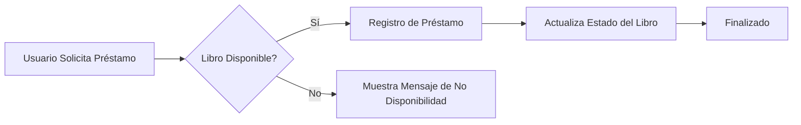
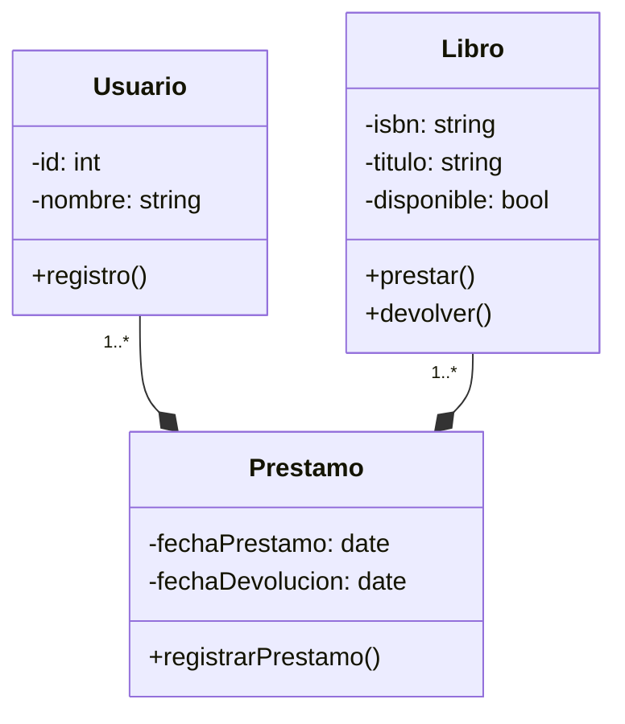

**Capitulo: Análisis Orientado a Objetos vs. Análisis Estructurado**

### **1. Introducción a la Unidad y Objetivos de Aprendizaje**

#### **Introducción**
En unidades previas, se presentó una visión general del Análisis Orientado a Objetos (AOO) y su contraste con el Análisis Estructurado (AE). Esta unidad profundiza en los aspectos fundamentales que diferencian a estas dos metodologías de análisis, permitiendo a los desarrolladores tomar decisiones informadas sobre cuál enfoque utilizar según el proyecto. 

#### **Objetivos de Aprendizaje**
- Comprender las bases teóricas del Análisis Estructurado y su evolución hacia el Análisis Orientado a Objetos.
- Identificar y analizar las diferencias clave entre AE y AOO en términos de modelado, abstracción y resolución de problemas.
- Evaluar la idoneidad de cada enfoque para diferentes tipos de proyectos de software.
- Aplicar conocimientos adquiridos para diseñar un ejemplo simple utilizando ambos métodos.

### **2. Documento Funcional de Requerimientos**

#### **a. Descripción Detallada de la Funcionalidad**
El objetivo es comparar cómo AE y AOO abordarían el análisis de un sistema de gestión de biblioteca, enfocándonos en la funcionalidad de préstamo de libros.

**Requerimientos del Sistema:**

- **Usuarios:** Administradores y lectores.
- **Funcionalidades:**
  - Registro de usuarios y libros.
  - Préstamo y devolución de libros.
  - Consulta de disponibilidad de libros.

#### **b. Diagramas con Sintaxis de Mermaid**

**Diagrama de Flujo (AE) para el Préstamo de Libros**


**Diagrama de Clases (AOO) para el Sistema de Biblioteca**


#### **c. Requisitos No Funcionales**
- **Escalabilidad:** El sistema debe poder manejar un aumento del 20% en el número de usuarios y libros dentro de los próximos dos años.
- **Seguridad:** Todos los datos de usuarios y préstamos deben ser cifrados.

### **3. Implementación en Python**

#### **a. Explicación Paso a Paso del Código**
Se proporcionará un ejemplo simplificado de implementación para ambos enfoques, centrado en la funcionalidad de préstamo de libros.

**Análisis Estructurado (Enfoque Procedural):**
```python
# Ejemplo AE - Préstamo de Libros
libros = {"ISBN1": {"titulo": "Libro1", "disponible": True}}

def prestar_libro(isbn):
    if isbn in libros and libros[isbn]["disponible"]:
        libros[isbn]["disponible"] = False
        print("Préstamo exitoso")
    else:
        print("No disponible")

prestar_libro("ISBN1")
```

**Análisis Orientado a Objetos:**
```python
# Ejemplo AOO - Clase Libro
class Libro:
    def __init__(self, isbn, titulo):
        self.isbn = isbn
        self.titulo = titulo
        self.disponible = True
    
    def prestar(self):
        if self.disponible:
            self.disponible = False
            print("Préstamo exitoso")
        else:
            print("No disponible")

libro1 = Libro("ISBN1", "Libro1")
libro1.prestar()
```

#### **b. Ejemplos de Uso y Pruebas Unitarias**
```python
# Prueba unitaria para la clase Libro (AOO)
import unittest

class TestLibro(unittest.TestCase):
    def test_prestamo_exitoso(self):
        libro = Libro("ISBN1", "Libro1")
        libro.prestar()
        self.assertFalse(libro.disponible)

if __name__ == '__main__':
    unittest.main()
```

### **4. Mejores Prácticas y Consideraciones de Diseño**

- ** Modularidad:** Utilice módulos en AE y clases en AOO para mantener la organización.
- **Reutilización de Código:** Aproveche las ventajas de la herencia en AOO para reducir duplicidad.
- **Seguridad:** Aplicar principios de seguridad desde el diseño, como validación de inputs y cifrado de datos sensibles.

**Consejos para Depuración:**
- Utilice herramientas de depuración integradas en su IDE.
- Impresiones estratégicas o logs para rastrear flujos y valores.
