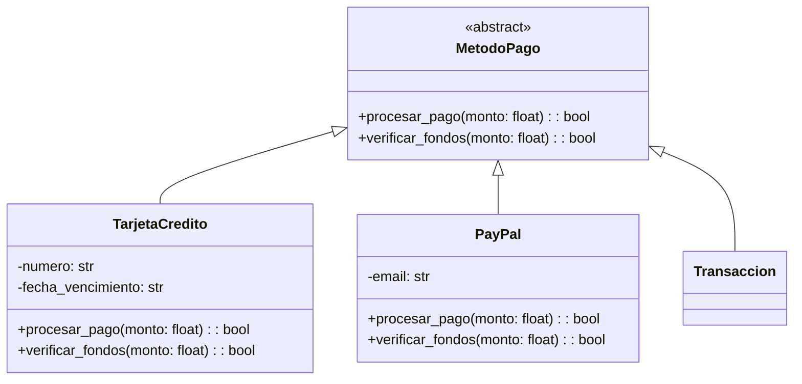

# Abstracción en Programación Orientada a Objetos con Python

## 1. Conceptos Fundamentales

La abstracción es un pilar fundamental de la POO que nos permite:
- Simplificar sistemas complejos
- Reutilizar código eficientemente
- Crear diseños flexibles y escalables
- Mejorar la seguridad del código

## 2. Implementación en Python

### 2.1 Clases Abstractas

```python
from abc import ABC, abstractmethod

class Animal(ABC):
    def __init__(self, nombre: str):
        self.nombre = nombre
    
    @abstractmethod
    def hacer_sonido(self) -> str:
        """Método que debe ser implementado por todas las subclases."""
        pass
    
    @abstractmethod
    def moverse(self) -> str:
        """Define cómo se mueve el animal."""
        pass

class Perro(Animal):
    def hacer_sonido(self) -> str:
        return "¡Guau!"
    
    def moverse(self) -> str:
        return "Caminando en cuatro patas"

class Pajaro(Animal):
    def hacer_sonido(self) -> str:
        return "¡Pío!"
    
    def moverse(self) -> str:
        return "Volando"
```

#### Diagrama de Clases


### 2.2 Ejemplo Práctico: Sistema de Pagos

```python
from abc import ABC, abstractmethod
from datetime import datetime
from typing import List, Dict

class MetodoPago(ABC):
    @abstractmethod
    def procesar_pago(self, monto: float) -> bool:
        pass
    
    @abstractmethod
    def verificar_fondos(self, monto: float) -> bool:
        pass

class TarjetaCredito(MetodoPago):
    def __init__(self, numero: str, fecha_vencimiento: str):
        self.numero = numero
        self.fecha_vencimiento = fecha_vencimiento
    
    def procesar_pago(self, monto: float) -> bool:
        if self.verificar_fondos(monto):
            print(f"Procesando pago de ${monto} con tarjeta {self.numero}")
            return True
        return False
    
    def verificar_fondos(self, monto: float) -> bool:
        # Simulación de verificación de fondos
        return True

class PayPal(MetodoPago):
    def __init__(self, email: str):
        self.email = email
    
    def procesar_pago(self, monto: float) -> bool:
        if self.verificar_fondos(monto):
            print(f"Procesando pago de ${monto} con PayPal ({self.email})")
            return True
        return False
    
    def verificar_fondos(self, monto: float) -> bool:
        # Simulación de verificación de fondos
        return True

class Transaccion:
    def __init__(self, metodo_pago: MetodoPago):
        self.metodo_pago = metodo_pago
        self.fecha = datetime.now()
    
    def ejecutar_pago(self, monto: float) -> bool:
        return self.metodo_pago.procesar_pago(monto)
```

#### Diagrama de Clases



### 2.3 Pruebas Unitarias

```python
import unittest

class TestMetodosPago(unittest.TestCase):
    def setUp(self):
        self.tarjeta = TarjetaCredito("1234-5678-9012-3456", "12/25")
        self.paypal = PayPal("usuario@email.com")
    
    def test_pago_tarjeta(self):
        transaccion = Transaccion(self.tarjeta)
        self.assertTrue(transaccion.ejecutar_pago(100.0))
    
    def test_pago_paypal(self):
        transaccion = Transaccion(self.paypal)
        self.assertTrue(transaccion.ejecutar_pago(50.0))

if __name__ == '__main__':
    unittest.main()
```

### Ejercicio: Tests con estos valores
- Test 1: Pago con tarjeta de crédito de $100
- Test 2: Pago con PayPal de $50
- Test 3: Pago con tarjeta de crédito de $200
- Test 4: Hacer un listado de transacciones

## 3. Ejercicio Práctico: Sistema de Biblioteca

```python
from abc import ABC, abstractmethod
from typing import List, Optional
from datetime import datetime, timedelta

class MaterialBiblioteca(ABC):
    def __init__(self, codigo: str, titulo: str):
        self.codigo = codigo
        self.titulo = titulo
        self.prestado = False
        self.fecha_devolucion: Optional[datetime] = None
    
    @abstractmethod
    def calcular_fecha_devolucion(self) -> datetime:
        pass
    
    def prestar(self) -> bool:
        if not self.prestado:
            self.prestado = True
            self.fecha_devolucion = self.calcular_fecha_devolucion()
            return True
        return False

class Libro(MaterialBiblioteca):
    def calcular_fecha_devolucion(self) -> datetime:
        return datetime.now() + timedelta(days=14)

class Revista(MaterialBiblioteca):
    def calcular_fecha_devolucion(self) -> datetime:
        return datetime.now() + timedelta(days=7)

class DVD(MaterialBiblioteca):
    def calcular_fecha_devolucion(self) -> datetime:
        return datetime.now() + timedelta(days=3)
```
## 3.1 Tarea
### Hacer diagrama de clases
### Hacer Diagrama de secuencia
### Hacer pruebas unitarias

## 4. Mejores Prácticas

1. **Diseño**:
   - Usar clases abstractas para definir interfaces comunes
   - Mantener la abstracción en el nivel adecuado
   - Separar responsabilidades claramente

2. **Implementación**:
   - Utilizar type hints para mejor documentación
   - Implementar métodos abstractos en todas las subclases
   - Mantener la cohesión alta y el acoplamiento bajo

3. **Testing**:
   - Probar cada implementación concreta
   - Verificar el comportamiento polimórfico
   - Cubrir casos especiales y errores

## 5. Ejercicios Propuestos

1. Implementar un sistema de notificaciones con diferentes medios (email, SMS, push)
2. Crear un simulador de vehículos con distintos tipos de transporte
3. Diseñar un sistema de procesamiento de archivos para diferentes formatos

## Conclusión

La abstracción en Python permite crear sistemas flexibles y mantenibles. La clave está en identificar las características comunes y modelarlas de manera que permitan extensibilidad y reutilización del código.